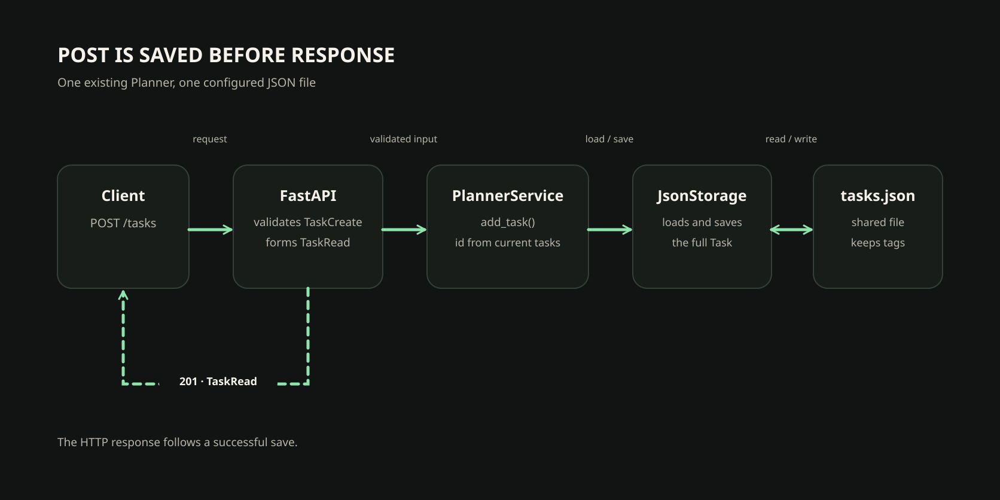

# 59. JSON-хранилище и серверные идентификаторы

<!-- youtube: -->

## 00. Успешный ответ должен соответствовать сохранённому состоянию

В предыдущем занятии мы описали отдельные формы запроса и ответа. Теперь проследим, что успешный POST изменяет в общем Planner и где подтвердим этот результат.

- **Точка старта.** Persistent Planner уже имеет `Task`, `PlannerService`, `JsonStorage` и CLI. В предыдущем занятии API получило отдельные схемы входа и ответа.
- **Новый вопрос.** Как доказать, что успешный POST изменил общий файл, а не только вернул красивый JSON?
- **Результат.** Проследим готовый путь `add_task`, проверим `id` и подтвердим чтение той же записи новым сервисом и CLI.

В предыдущем занятии мы разделили вход и ответ. Но схема ответа сама ничего не сохраняет. В этом занятии не будем писать второе хранилище или ещё один генератор `id`. Проследим, как уже работающий Planner создаёт задачу и где подтверждается её постоянное сохранение.

---

## 01. Один POST проходит через готовое ядро

Разберём путь одной задачи. Здесь важно отделить HTTP-обработчик от предметного действия и от работы с файлом.

1. **Вход.** FastAPI принимает проверенный `TaskCreate` с `title` и `priority`.
2. **Действие.** Маршрут передаёт эти значения существующему `PlannerService.add_task()`.
3. **Состояние.** Сервис загружает `Task`, применяет правила Planner и назначает серверный `id`.
4. **Сохранение.** `JsonStorage` переводит `Task` в прежний формат JSON и записывает общий файл.
5. **Ответ.** Сервис возвращает `Task`, а API формирует публичный `TaskRead` и статус `201`.

Схема запроса не создаёт задачу. Она только проверяет вход. Предметное действие выполняет сервис, а постоянную запись в прежнем формате создаёт хранилище. Публичный ответ появляется после успешного сохранения.

На схеме проследим один настоящий маршрут от запроса до общего файла и назад к тому же клиенту. Стрелка ответа начинается у API только после того, как сервис закончил сохранение.



TaskCreate похожа на заполненную форму выдачи читательского билета: форма задаёт, какие сведения сообщил человек, но сама не создаёт запись в каталоге. PlannerService применяет правила и назначает номер, JsonStorage сохраняет полную задачу, а TaskRead описывает выданный клиенту ответ. Граница аналогии: TaskRead является схемой данных, а не физическим билетом и не командой сохранения.

В предыдущем занятии `TaskRead` намеренно не включала `tags`: публичный ответ и сохранённая доменная запись решают разные задачи. Сервис передаёт в `JsonStorage` полную `Task`, поэтому сериализация сохраняет и поля, которых нет в HTTP-ответе. Если сохранить только `TaskRead`, часть состояния исчезнет при следующем чтении файла. Поэтому ниже сверим `tags` после загрузки новым сервисом.

Посмотрим на ту же последовательность в независимом примере. Это обычный Python-код, не код Planner:

```python
def add_book(title, storage):
    books = storage.load()
    book = {"title": title}
    books.append(book)
    storage.save(books)
    return book
```

Функция сначала загружает текущее состояние, затем добавляет запись и передаёт обновлённый список в `save()`. Только после успешного сохранения она возвращает результат. Если запись завершилась ошибкой, строка с `return` не будет достигнута.

Для Planner название и приоритет приходят из `TaskCreate`, но `id` назначает существующий сервис. Форму ответа затем ограничивает `TaskRead`. Ни одна из этих схем не заменяет `save()`.

---

## 02. Как отличить файл от состояния одного процесса

Список Python можно прочитать повторно, пока жив процесс. Это ещё не доказывает, что данные переживут его завершение.

В предыдущем курсе мы уже построили `JsonStorage` с `load()` и `save()`. Его назначение здесь не нужно изобретать заново. Нужно проверить, что точка сборки CLI и API выбирает один и тот же путь к файлу.

```text
CLI → build_service() ─┐
                       ├→ PlannerService → JsonStorage → data/tasks.json
API → build_service() ─┘
```

Файл задаёт общее постоянное состояние. Два отдельных процесса не делят переменные Python, но могут последовательно читать и менять один файл через одинаковую настройку.

Одного имени `data/tasks.json` недостаточно, чтобы доказать общий файл: относительный путь разрешается от текущей рабочей папки. CLI и API могут запускаться из разных каталогов и с тем же именем попасть в разные файлы. Сверим фактический путь, который получает `build_service()`. Разные экземпляры `PlannerService` ожидаемы; общий Python-объект между процессами для этого не нужен.

Представим двух сотрудников с отдельными столами и общей картотекой. Записи на столе похожи на данные, оставшиеся в объекте одного процесса; файл JsonStorage похож на общую картотеку, которую новый сотрудник открывает заново. Новый PlannerService увидит задачу, если его сборка указывает на тот же путь. Аналогия не обещает согласование одновременной работы: два процесса могут сохранить один и тот же старый снимок, поэтому позже отдельно разберём границу последовательной работы с JSON.

### Какое наблюдение доказывает сохранение?

**Вариант A:** добавить задачу и снова спросить тот же объект `service`. Это показывает, что объект видит результат. Но так ещё нельзя отличить файл от данных, оставшихся в памяти.

**Вариант B:** создать задачу, собрать новый `service` и прочитать её снова. Если новый `build_service()` использует тот же настроенный путь, он получает данные из постоянного источника.

Новый экземпляр важен, потому что у него нет прежнего списка Python. Он снова загружает файл. В реальном проекте путь задаётся в точке сборки. Если он зависит только от текущей папки терминала, одинаковый запуск из разных мест может обратиться к разным файлам. Поэтому проверяйте настройку в проекте, а не угадывайте её по имени `data/tasks.json`.

**Сверим понимание.** Если новый `PlannerService` использует тот же настроенный путь `JsonStorage`, он может прочитать задачу после перезапуска?

**Разбор.** Да. Новый объект не хранит старые Python-переменные. Он читает файл по настроенному пути и восстанавливает из него `Task`.

---

## 03. Сервер назначает id по реальным записям

Правило `id` уже появилось в Persistent Planner. Здесь проверим, на какое состояние оно опирается и чего не обещает.

В текущем Planner следующий `id` рассчитывается от существующих записей: берётся наибольший сохранённый `id` и прибавляется единица. Поэтому количество задач и следующий `id` не всегда связаны.

Сравним два расчёта. В списке три задачи, но значения `id` идут с пропусками:

```python
ids = [2, 7, 11]
print(len(ids) + 1, max(ids) + 1)
```

**Ответ:** `4 12`.

Для действующего правила Planner правильное значение зависит от максимального `id`. Расчёт через `len()` ошибся бы при пропусках. А если удалить запись с максимальным `id`, правило `max(текущих id) + 1` может выдать это число снова. Значит, такой `id` уникален среди текущих задач, но не является вечным счётчиком истории.

Клиент сообщает `title` и `priority`. Сервис назначает `id` и начальное `is_done=False`; значения этих серверных полей нельзя выбрать через `TaskCreate`. В Pydantic лишние поля по умолчанию игнорируются, если этот режим не изменён отдельно. Поэтому переданный клиентом `id` не назначает задаче номер, а `is_done` не меняет начальный статус; сами лишние поля не означают ошибку `422`. `TaskRead` возвращает уже назначенные значения.

Результат зависит от настройки входной модели. При `extra=ignore` неизвестные ключи отбрасываются, и сервис получает только объявленные поля. При `extra=forbid` тот же запрос остановится с `422` до вызова `add_task()`. Поэтому перед проверкой сверим политику `TaskCreate`, а не будем считать поведение лишних полей универсальным правилом. Сам серверный `id` в обоих случаях остаётся правилом Planner.

Правило похоже на нумерацию ячеек в архиве: чтобы выбрать следующий номер, смотрим на наибольшую занятую метку, а не считаем количество занятых ячеек. Пропуски не сбивают расчёт. Но метка не является вечным номером истории: если удалить запись с максимальным `id`, `max(текущих id) + 1` может выдать его снова.

---

## 04. Проверка должна пересечь границу сохранения

Один удачный ответ показывает то, что API сообщило клиенту. Чтобы проверить состояние, сравним несколько независимых наблюдений:

- **HTTP.** POST возвращает `201` и фактический `id`. GET проверяет, что маршрут читает созданную задачу.
- **CLI.** Та же задача видна через старый интерфейс, который пользуется тем же Planner.
- **Новый экземпляр.** После остановки и повторной сборки сервиса данные снова читаются из файла.
- **Тестовый путь.** `pytest` использует `tmp_path`, чтобы проверить сохранение и не менять рабочий JSON ученика.

Эти проверки отвечают на разные вопросы. `201` проверяет контракт ответа. GET показывает путь чтения API. CLI проверяет общий проектный интерфейс. Новый экземпляр или процесс отделяет постоянный файл от состояния, которое могло остаться в памяти.

У каждого наблюдения своя роль. Перезапуск проверяет чтение после завершения прежнего процесса, а CLI подтверждает работу существующего интерфейса с сохранёнными данными. Сервисный тест в `tmp_path` изолирует одну операцию от рабочего JSON. Создание в нём проходит через `add_task()`, затем новый `PlannerService` читает тот же временный путь. Прямой вызов `JsonStorage.save()` обошёл бы выдачу `id` и проверил бы не весь нужный путь.

**Сверим понимание.** Сам по себе статус `201` доказывает, что после перезапуска задача будет прочитана из JSON?

**Разбор.** Нет. `201` сообщает клиенту об успешном создании по контракту API. Сохранение подтверждается чтением того же файла новым экземпляром или после перезапуска.

---

## 05. Ошибка JsonStorage не означает пустой Planner

Ранее мы различали ошибки входа, предметного поиска и хранения. Не смешивайте их:

- **422.** Неверное тело не прошло `TaskCreate`. Маршрут не начал создание.
- **404.** Запрос корректен, но сервис не нашёл задачу с таким `id`.
- **StorageError.** Файл нельзя прочитать или восстановить. Это внутренняя проблема данных, а не отсутствие одной задачи.

Если повреждённый файл превратить в пустой список, API покажет, будто Planner потерял все задачи. Следующее сохранение может затереть исходные данные. Ошибку формата нужно оставить заметной и не продолжать создание, как будто файл был пуст.

Отсутствие одной задачи и нечитаемость всего списка возникают на разных шагах. `TaskNotFoundError` возможен после успешной загрузки корректного файла, когда конкретного `id` в нём нет. При `StorageError` сервис не знает, какие записи сохранены. Если свести обе причины к пустому списку или `404`, клиент получит ложный ответ, а следующее изменение может скрыть повреждение.

**Разберём причину ошибки.** Почему опасен этот обработчик?

```python
def load_tasks(storage):
    try:
        return storage.load()
    except StorageError:
        return []
```

**Ответ.** Он превращает неизвестное состояние файла в пустое и скрывает проблему. Последующая запись может затереть данные. Отсутствующая задача и невозможность прочитать всё хранилище имеют разные причины. `StorageError` нельзя маскировать под пустое состояние или `404`.

---

## 06. Границы JSON-файла

`JsonStorage` подходит текущему небольшому Planner, но файловый контракт не обещает работу базы данных.

При последовательной работе CLI и API каждый вызов загружает актуальное состояние и сохраняет результат. Именно такой сценарий мы проверим. Одновременные записи сложнее: два процесса могут прочитать один снимок, изменить его независимо, а последняя запись затрёт изменение другой.

JSON-запись заменяет представление списка целиком, а не фиксирует отдельную задачу транзакцией. Если два процесса загрузили один исходный снимок, каждый сформирует и сохранит собственный список. Общий путь помогает при последовательной работе, но сам не объединяет такие изменения и не защищает от последней перезаписи. В этом занятии проверяем последовательный сценарий и не маскируем ограничение дополнительным временным storage.

```text
Процесс A: load [1] → добавляет 2 → save [1, 2]
Процесс B: load [1] → добавляет 3 → save [1, 3]

Итог, если B записал последним: [1, 3]
```

JSON-файл не даёт автоматически транзакции и безопасную координацию нескольких писателей. Мы не добавляем блокировки и не заменяем storage базой данных в этом занятии. Для проверки достаточно выполнять действия последовательно.

**Сверим границу.** Два клиента почти одновременно создали задачу, но одна запись пропала. Что могло произойти при чтении и сохранении общего файла?

**Разбор.** Оба процесса могли загрузить одинаковый старый снимок. Затем каждый сохранил собственный список, и последняя запись затёрла предыдущую. Это ограничение конкурентной работы с одним JSON-файлом.

---

## 07. Что мы будем делать в практике

Практика не реализует `JsonStorage` или алгоритм создания заново. Мы проверим части существующего Planner и добавим изолированное доказательство для файла.

1. **Проследим** путь POST от `TaskCreate` через `add_task()` до `JsonStorage.save()` и выясним, где API и CLI получают настройку общего файла.
2. **Проверим** две созданные задачи по фактическим `id` через API и CLI, в том числе после перезапуска; лишние `id` и `is_done` во входе не подменяют серверные значения.
3. **Добавим** тест с временным JSON, где пропуски в `id` отличают максимальный номер от количества записей, а новый сервис заново загружает полный файл вместе с `tags`.
4. **Подтвердим**, что повреждённый JSON вызывает `StorageError`, а файл остаётся нетронутым.

Путь проекта остаётся один: проверка не создаёт вторую реализацию и не меняет рабочий JSON автотестами. Результат виден в фактических ответах API и CLI, а регрессия проверяется на `tmp_path`.

---

## 08. Главное из занятия

- `TaskCreate` проверяет вход, `PlannerService` выполняет создание, `JsonStorage` сохраняет `Task`, а `TaskRead` задаёт HTTP-ответ.
- Новый экземпляр на том же настроенном пути проверяет, что данные пережили прежний объект и процесс.
- Следующий `id` зависит от сохранённых `id`, а не от числа записей или догадки клиента.
- Повреждённое хранилище нельзя выдавать за пустой список или отсутствие одной задачи.
- JSON подходит текущему последовательному сценарию, но сам не решает конкурентную запись.

Дальше проверим, что API и CLI используют одно прикладное ядро. Новые маршруты должны вызывать существующий `PlannerService`, а не повторять его правила внутри HTTP-обработчиков.
