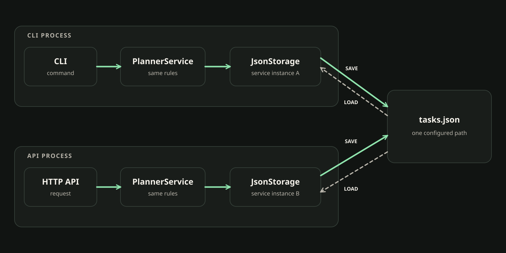

# 60. Единый PlannerService для CLI и API

<!-- youtube: -->

## 00. Два интерфейса продолжают один проект

- **Прежняя опора.** В предыдущем занятии POST, CLI и API проверялись на общем JsonStorage. Task и PlannerService уже выполняют предметную работу.
- **Новый вопрос.** Как не получить два набора правил, когда к CLI добавился HTTP-интерфейс?
- **Результат.** Сверим границы API, CLI, PlannerService и JsonStorage и закрепим их тестами сервиса.

CLI принимает текстовую команду. API принимает HTTP-запрос. Это разные двери в Planner. Но правила списка, поиска и статистики не должны зависеть от того, в какую дверь вошёл человек.

## 01. Два интерфейса, одно ядро

CLI и сервер часто работают в разных процессах. Поэтому у каждого может быть собственный объект PlannerService. Они всё равно увидят одни данные, если build_service связывает сервис с тем же настроенным файлом JsonStorage.

```text
CLI → build_service() ─────┐
                           ├→ PlannerService → JsonStorage → общий tasks.json
API → build_service() ─────┘
```

В FastAPI объект сервиса хранится в app.state.planner. Сам endpoint должен передать ему операцию, а не читать файл напрямую.

```python
# Упрощённая схема сборки, не полный файл приложения
cli_planner = build_service()
cli_tasks = cli_planner.list_tasks()

app.state.planner = build_service()
api_tasks = app.state.planner.list_tasks()
```

Оба вызова создают отдельные объекты. Общим остаётся путь к JSON и поведение уже существующего PlannerService. Не нужно передавать объект из CLI в сервер или хранить список на уровне модуля.

**Проверьте себя.** Обязаны ли CLI и API использовать один объект PlannerService в памяти?

**Разбор.** Нет. Обычно они работают в разных процессах. Каждый собирает свой сервис, настроенный на общий постоянный файл.

Это похоже на два окна обслуживания одной библиотеки. Через одно посетитель задаёт вопрос устно, через другое отправляет электронную форму. Сотрудники и способы ответа могут быть разными, но правила поиска одинаковы и опираются на один каталог. В сравнении окна соответствуют CLI и HTTP, сотрудники соответствуют отдельным объектам PlannerService, а правила поиска соответствуют общей реализации сервиса. Граница аналогии важна: два сотрудника не разделяют рабочую память. В приложении совпадает настроенный путь к файлу, а не Python-объект между процессами.



На схеме оба интерфейса проходят через одни правила PlannerService. Сохранение и чтение идут через отдельные экземпляры JsonStorage к одному настроенному файлу. Общим является постоянный источник данных, не объект Python в памяти.

## 02. Ответственность каждого слоя

Эти части разделены не ради количества файлов. Благодаря границам можно поменять HTTP-ответ, не меняя правила Planner.

- **API** принимает HTTP-вход и задаёт внешний статус и формат ответа.
- **PlannerService** применяет прикладные правила и возвращает доменный результат.
- **JsonStorage** читает и сохраняет Task в настроенном файле.
- **build_service** собирает объекты и связывает сервис с хранилищем.

Если endpoint открывает JSON и ищет запись самостоятельно, появляется второй путь к данным. Если сервис импортирует FastAPI и выбирает HTTP-код, предметное ядро начинает зависеть от одного интерфейса. Направление вызовов простое: API и CLI обращаются к сервису, а сервис использует модель и хранилище.

**Соедините роль и ответственность.** Ответ после попытки: HTTP-обработчик проверяет вход и формирует ответ; PlannerService выполняет предметное действие; JsonStorage отвечает за файл; build_service собирает зависимости.

Task является доменной записью Planner и содержит не только поля публичного ответа. API может выбрать для клиента четыре поля, но это преобразование не удаляет tags из Task и не должно записывать сокращённую проекцию обратно в JsonStorage. Схема ответа отвечает за внешний вид результата, а сериализация доменной Task сохраняет прежний формат файла.

## 03. Сервис можно проверить без сервера

PlannerService не должен зависеть от HTTP, чтобы его можно было вызывать из CLI и обычного теста. Сервисный тест создаёт PlannerService с временным JsonStorage, вызывает метод и проверяет результат. Uvicorn и HTTP-клиент для этого не нужны.

Сравните два способа получить задачу:

```python
# Поиск внутри HTTP-обработчика
with open("data/tasks.json", encoding="utf-8") as file:
    tasks = json.load(file)
task = next((item for item in tasks if item["id"] == task_id), None)

# Вызов общего сервиса
task = app.state.planner.get_task(task_id)
```

Первый вариант обходит готовый сервис и напрямую знает формат хранения. Второй оставляет поиск в PlannerService. HTTP-обработчик затем переводит ожидаемый результат в публичный ответ.

В примере показан успешный путь. Рабочий endpoint отдельно переводит ожидаемое отсутствие в 404, но не скрывает StorageError. Сам PlannerService не выбирает HTTP-статус и не отвечает за JSON-сериализацию.

**Что выбрать?** Второй вариант. Это не требует вводить новый repository pattern или переписывать приложение. Достаточно сохранить существующую границу.

tmp_path отделяет тестовые данные от пользовательского файла. Каждый тест может подготовить известную запись через JsonStorage, создать PlannerService, выполнить операцию и сравнить результат. Временный путь делает тест повторяемым: предыдущий запуск не оставляет задачи, которые поменяют следующий результат.

Проверка только того же объекта сервиса слабее, чем повторное чтение. Если метод случайно изменил список в памяти, он может показать правильный ответ до завершения процесса, хотя файл не обновился или был заменён выборкой. Новый PlannerService для того же временного пути не имеет прежнего списка в памяти. Он перечитывает источник и помогает проверить настоящее сохранённое состояние.

Возвращённый объект в памяти и сохранённая запись тоже не одно и то же. select_tasks подготавливает список для текущего ответа на основе list_tasks; это чтение не вызывает save. После такой операции мы проверяем не только выбранный результат, но и то, что полный файл остался прежним. Если позже изменяющий метод вернул Task, отдельная проверка постоянного состояния покажет, дошёл ли результат до JsonStorage.

## 04. Выборка не заменяет полный список

Метод select_tasks уже появился при подключении query-параметров. Он готовит список для HTTP-ответа: применяет фильтр, сортирует по id, затем ограничивает число результатов. Он не удаляет записи и не меняет JsonStorage.

Например, из состояний ниже выберем незавершённые задачи, расположим их по убыванию id и оставим одну:

```python
tasks = [
    {"id": 2, "is_done": False},
    {"id": 7, "is_done": True},
    {"id": 11, "is_done": False},
]
selected = sorted(
    (task for task in tasks if task["is_done"] is False),
    key=lambda task: task["id"],
    reverse=True,
)[:1]
print([task["id"] for task in selected])
print([task["id"] for task in tasks])
```

Ожидаемый вывод:

```text
[11]
[2, 7, 11]
```

Результат выборки содержит одну задачу, но исходный список не изменился. Именно поэтому полный list_tasks и get_statistics продолжают работать со всем состоянием Planner. Фильтр is_done=False тоже отличается от отсутствия фильтра: None означает «оставить оба статуса».

**Верно или неверно?** После фильтрации GET /tasks статистика должна считать только отобранные записи.

**Разбор.** Неверно. Выборка является представлением, а не новым состоянием. get_statistics считает проект целиком и сохраняет старый договор сервиса all/open/done.

При чтении удобно думать о select_tasks как о подготовленной витрине, а не о новом хранилище. Фильтр определяет подходящие записи, сортировка задаёт порядок, limit оставляет нужное количество. Это похоже на экран каталога библиотеки: показанные строки меняются, когда мы задаём поиск, но сами книги не перемещаются и не исчезают. Здесь аналогия заканчивается на отображении: Planner возвращает Python-объекты, а исходное состояние находится за договором JsonStorage.

## 05. Ошибки нельзя сводить к одному ответу

HTTP-обработчик переводит ожидаемую ситуацию в понятный статус. Но широкое исключение может скрыть настоящую поломку.

```python
try:
    task = app.state.planner.get_task(task_id)
except Exception:
    raise HTTPException(404, "Task not found")
```

Этот код превращает любую ошибку в 404. Если JsonStorage не смог прочитать файл, проблема не в том, что один id отсутствует. Здесь различаются причины:

- TaskNotFoundError означает, что сервис не нашёл конкретную задачу.
- ValueError означает, что значение нарушает правило Planner.
- StorageError означает, что хранилище не прочитало или не записало состояние.
- Невалидные типы и границы query FastAPI отклоняет до входа в endpoint.

Для ожидаемого отсутствия обработчик может перехватить именно TaskNotFoundError. StorageError нельзя маскировать под пустой список или 404. Иначе клиент увидит ложное состояние и может продолжить работу, будто данные целы.

**Найдите причину ошибки.** Ошибка в примере в том, что он ловит Exception целиком. Исправление должно ограничить обработку ожидаемым TaskNotFoundError; ошибки хранилища должны оставаться заметными.

## 06. Регрессия сервиса и границы данных

select_tasks уже реализован. Сейчас проверим, что его результат не подменяет полный список, статистику и содержимое файла. Для этого тест использует tmp_path, который создаёт отдельный временный JSON.

Правильный порядок проверки такой:

1. Сохранить несколько Task в JsonStorage на временном пути.
2. Создать PlannerService с этим хранилищем.
3. Вызвать select_tasks с фильтром, сортировкой и limit.
4. Проверить результат, полный list_tasks, статистику и повторно загруженный файл.

Такой тест отвечает на вопрос о предмете: правильно ли Planner подготовил выборку и сохранил прежнее состояние. Он не проверяет маршрутизацию FastAPI. Это отдельный слой и отдельный вид проверки.

## 07. Что мы будем делать в практике

Практика закрепляет одно прикладное ядро, а не реализует CRUD заново.

1. Проследим, как CLI и API получают PlannerService через build_service. Проверим, что endpoint делегирует работу сервису, а не открывает JSON напрямую.
2. Добавим изолированный тест, который проверит select_tasks рядом с полным list_tasks, get_statistics и сохранённым JSON.
3. Проверим различие TaskNotFoundError, ValueError и StorageError на сервисной границе.
4. Сверим чтение списка и статистики в CLI и HTTP на реальных данных Planner. GET не должен менять файл.

Результат: API и CLI продолжают работать с одним Planner, а выборка для ответа не становится новым источником состояния. Следующий шаг добавит обновление уже найденной задачи, не заменяя сервис или хранилище.

## 08. Главное из занятия

- CLI и API могут собирать отдельные объекты PlannerService, настроенные на один путь JsonStorage.
- HTTP отвечает за внешний договор; сервис выполняет предметные операции; storage сохраняет состояние.
- select_tasks готовит выборку, а list_tasks и статистика описывают весь Planner.
- Тесты сервиса используют tmp_path и проверяют ядро без запуска Uvicorn.
- TaskNotFoundError, ValueError и StorageError описывают разные причины и не должны маскироваться друг под друга.
