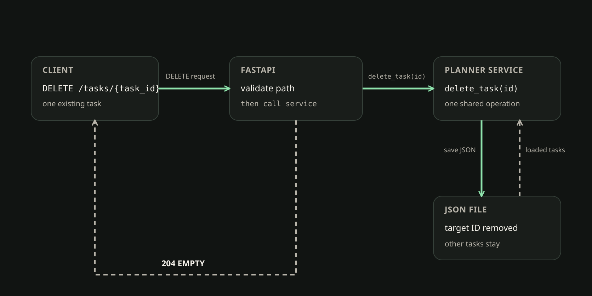

# 62. DELETE, 204 и HTTPException

<!-- youtube: -->

## 00. От изменения к удалению

- **Прежняя опора.** CLI и API читают и меняют задачи через один PlannerService и общий JsonStorage.
- **Новый вопрос.** Как подтвердить удаление, если серверу не нужно возвращать удалённую Task?
- **Результат.** DELETE использует готовую операцию, сохраняет отсутствие задачи и отвечает пустым 204.

В прошлом занятии мы меняли поля найденной задачи. Теперь меняется само её существование. Удаление уже работает для CLI, поэтому мы не создаём вторую реализацию. Мы подключим готовый PlannerService к HTTP и проследим, что произойдёт с ответом и сохранённым JSON.

## 01. Удаляем ресурс, а не позицию в списке

Запрос `DELETE /tasks/{task_id}` указывает на идентификатор ресурса. Путь `task_id: int` сообщает FastAPI, что мы ожидаем целое число. Тело для такого запроса не нужно: действие относится к задаче, которую сервер уже хранит.

Идентификатор задачи и её позиция в списке отвечают на разные вопросы. ID остаётся за Task, а позиция показывает, где она оказалась после сортировки или удаления соседней записи. Если стереть элемент по позиции, можно затронуть не ту задачу. PlannerService уже находит Task по её ID, удаляет её и сохраняет оставшийся список. HTTP-маршрут передаёт сервису адрес, но не открывает файл и не повторяет эти шаги.

Это похоже на библиотечный каталог. Читатель просит книгу по инвентарному номеру, а не «взять третью книгу с верхней полки». Если книги переставить, её номер останется прежним, а номер строки в списке изменится. Аналогия ограничена: HTTP не работает с реальными полками, но помогает увидеть разницу между устойчивым ID и временной позицией.

Сравним, где выполняется поиск и удаление:

```python
# Один путь через готовый сервис
app.state.planner.delete_task(task_id)

# Второй поиск и удаление внутри endpoint
```

Первый вариант оставляет правило в одном месте для CLI и API. Во втором появляется параллельный путь к данным. Такой endpoint может изменить JSON иначе, чем существующий сервис, или забыть сохранить соседние задачи. В этой схеме у каждого слоя своя работа. FastAPI превращает часть URL в целый task_id и передаёт его дальше; PlannerService не обязан знать об HTTP-кодах. Сервис выражает результат предметной операцией, а endpoint выбирает внешний ответ. Благодаря этому CLI продолжает вызывать тот же сервис без HTTPException или Response, а файл остаётся обязанностью JsonStorage. Маршрут связывает два договора и не становится новым местом для правил Planner.

## 02. Ожидаемое отсутствие и настоящая ошибка

`HTTPException` останавливает обычное выполнение маршрута и позволяет FastAPI вернуть клиенту ожидаемый HTTP-статус. Она не заменяет проверку данных и не должна скрывать любую ошибку под одним ответом.

Сначала FastAPI преобразует значение пути в тип `int`. Если вместо числа пришёл текст, функция маршрута не запускается и клиент получает 422. Если число корректно, но такой Task нет, готовый сервис сообщает об этом через `TaskNotFoundError`. Маршрут переводит именно эту известную ситуацию в 404. Так клиент понимает: запрос сформирован, но указанного ресурса нет.

Ошибка чтения или записи JSON означает другое. `StorageError` говорит о проблеме с сохранением или доступом к данным, а не об отсутствующей Task. Если поймать её как 404, мы теряем причину сбоя. Если после неудачного сохранения всё же вернуть 204, клиенту будет обещан результат, который сервис не подтвердил.

Разберём обработчик, который смешивает эти случаи:

```python
try:
    app.state.planner.delete_task(task_id)
except Exception:
    raise HTTPException(status_code=404, detail="Task not found")
```

Ошибка здесь в широком `except Exception`: он перехватывает и ожидаемое отсутствие, и сбой хранилища, и непредусмотренную ошибку в программе. Мы оставляем на HTTP-границе только узкий `except TaskNotFoundError`. Тогда 404 означает конкретную причину, а проблемы хранения остаются серверной ошибкой и видны при разборе.

У трёх исходов разные места и смысл:

- **422.** FastAPI не преобразовал путь в целое число; сервис ещё не вызывался.
- **404.** Путь корректен, но PlannerService не нашёл Task с таким ID.
- **Ошибка storage.** Приложение не прочитало или не сохранило JSON; это не ответ «задачи нет».

Различие между 422 и 404 связано с тем, успели ли мы найти задачу. 422 говорит о форме адреса: строку нельзя использовать как целое число, поэтому поиска ещё не было. 404 означает, что формат корректен и сервис проверил данные, но запись не обнаружил. Такое разделение не даёт ошибке адреса или отсутствию Task превратиться в удаление другой записи.

## 03. 204 сообщает об успехе без представления

После успешного удаления клиенту не требуется копия уже удалённой Task. Для этого DELETE может ответить `204 No Content`: запрос выполнен, а тело ответа отсутствует. Это не пустой объект и не JSON-значение `null`. В теле нет байтов с моделью или другим содержимым.

Маршрут объявляет статус 204 и при успехе возвращает пустой `Response`. Для такого ответа не задают `response_model`: серверу нечего сериализовать как публичную модель. Если клиенту понадобятся данные о соседних задачах или статистике, он сделает отдельный GET после удаления. Успешный ответ не должен скрывать состояние, которое клиенту важно проверить. Статус 200 обычно сопровождается представлением ресурса, если маршрут решил его вернуть. Статус 204 выбирает другой договор: операция завершилась, но представления в ответе нет. Явный Response удерживает этот результат и не просит клиента угадывать, означает ли отсутствие JSON пропущенную сериализацию. Отдельная проверка состояния всё равно нужна.

Рассмотрим независимый пример: отмену бронирования, где операция сервиса уже существует.

```python
@app.delete("/bookings/{booking_id}", status_code=204)
def cancel_booking(booking_id: int):
    try:
        booking_service.cancel(booking_id)
    except BookingNotFoundError:
        raise HTTPException(status_code=404)
    return Response(status_code=204)
```

HTTP-маршрут выбирает форму ответа, а booking_service выполняет предметное действие. Это похоже на отмену брони через стойку регистрации: сотрудник снимает бронь и подтверждает отмену, но не возвращает клиенту копию бронирования как тело сообщения. Чтобы узнать актуальный список броней, клиент запрашивает его отдельно. Граница сравнения важна: короткое подтверждение само по себе не доказывает запись на диск. В Planner ответ 204 появляется только после успешного возврата операции delete_task, а сохранение мы подтверждаем отдельным чтением.

**Проверим понимание.** После DELETE со статусом 204 клиент разбирает JSON и получает удалённую задачу?

Нет. У 204 нет тела. Клиент проверяет статус и пустое содержимое, а для чтения нового состояния отправляет отдельный GET. Вызов `json()` у пустого ответа не даст удалённую модель и может завершиться ошибкой разбора.

Сравним две формы успешного ответа:

```text
TaskRead в ответе → тело с представлением задачи
Response со статусом 204 → пустое тело
```

Если договор требует 204, возвращаемый объект или JSON `null` противоречит этому договору. Если клиенту нужна модель в теле, понадобится другой статус и отдельное решение API. В нашем маршруте удалённая Task не сериализуется обратно.

## 04. Путь запроса до сохранённого удаления

Проследим один запрос от клиента до файла и обратно. Рисунок показывает две границы: API передаёт работу прикладному сервису, а успешный HTTP-ответ возвращается тому же клиенту. Сервис обращается к JSON и сохраняет список без удалённого ID.



Внутренний вызов `delete_task(task_id)` не является отдельным HTTP-запросом. Это переход от веб-границы к уже готовому прикладному действию. Направление ответа 204 другое: он завершает внешний обмен и возвращается отправителю DELETE. JSON хранит полный Planner: после сохранения исчезает одна запись, остальные и их `tags` остаются частью проекта.

Порядок помогает понять, почему нельзя отправить 204 заранее:

1. Запрос DELETE приходит в FastAPI с ID из пути.
2. FastAPI проверяет, что ID можно преобразовать в целое число.
3. Маршрут вызывает PlannerService, который удаляет Task и сохраняет оставшиеся данные.
4. После успешного вызова API возвращает пустой Response со статусом 204.

Если ID корректен, но неизвестен сервису, успешный путь прерывается на шаге удаления и маршрут возвращает 404. Если сохранение завершается StorageError, шаг ответа 204 не наступает. Мы не добавляем в endpoint новые операции чтения и записи файла.

## 05. Повторное обращение подтверждает отсутствие

Первый DELETE и повторный DELETE имеют разные HTTP-статусы, потому что описывают разные события. Сначала задача существует, сервис сохраняет её удаление, и клиент получает 204. При следующем обращении тот же ID уже отсутствует, поэтому GET и DELETE отвечают 404.

- **Первый DELETE.** Сервис находит существующую Task, сохраняет список без неё; ответ пустой, со статусом 204.
- **Следующие GET и DELETE.** Того же ID нет; оба обращения сообщают 404 и не создают новую запись.
- **Свежая проверка.** Новый load подтверждает отсутствие, а соседние задачи и их tags остаются на месте.

Статусы различаются, но конечное состояние совпадает: Task с этим ID не находится в Planner. Повторный запрос не удаляет соседнюю запись. Мы проверяем не то, что сервер два раза прислал одинаковый код, а то, что второй запрос не отменил достигнутое состояние.

Между удалением и повторными проверками не создаём другую задачу. Генератор ID может снова выдать ранее удалённый максимальный номер. Тогда GET увидит уже новую Task с тем же числом, и проверка ошибочно припишет её старому объекту. Поэтому в практике мы записываем фактический ID из ответа POST, выполняем все проверки отсутствия подряд и только затем продолжаем работу с Planner.

Статистика тоже зависит от удалённой записи. Удаление открытой задачи уменьшает total и open; удаление завершённой уменьшает total и done. Счётчики нужно сверять с реальным начальным состоянием проекта, а не с заранее угаданными числами.

## 06. Как доказать сохранённое удаление

Ответ 204 подтверждает HTTP-результат, но для проверки постоянного состояния прочитаем тот же источник ещё раз. API и CLI должны видеть один JSON через существующий PlannerService. Новый GET, команда CLI или новый экземпляр сервиса с тем же настроенным путём помогают отличить сохранённое отсутствие от изменения только в памяти процесса.

Снимем реальные ID, tags и статистику до опыта. Затем создадим отдельную открытую Task готовым POST и запишем ID из ответа. Эта задача проходит знакомые операции предыдущего занятия. Если обозначить начальные счётчики как N/O/D, после POST получим N+1/O+1/D. Полный PUT со статусом завершения даст N+1/O/D+1. PATCH со значением `is_done=False` снова откроет эту же Task: N+1/O+1/D. Теперь DELETE удаляет именно её, и после нового чтения счётчики возвращаются к исходным N/O/D.

Такой порядок проверяет не только маршрут удаления. Мы подтверждаем, что POST создал сохранённую запись, PUT заменил статус, PATCH применил явное `False`, а DELETE удалил ту же Task. Не очищаем рабочий файл ради знакомых ID и не вычисляем следующий ID по длине списка. Соседние записи должны сохранить ID и tags, а статистика должна соответствовать фактическому набору.

Сначала отдельно убеждаемся, что ответ 204 пустой. Не пытаемся вызывать `json()` у него. Затем читаем список или конкретный ID через GET и CLI, смотрим статистику и после перезапуска/новой загрузки повторяем чтение. Эти проверки дополняют друг друга: HTTP показывает контракт, а новый load показывает, что файл хранит результат. Не создаём новую Task между GET с 404 и повторным DELETE.

## 07. Что мы будем делать в практике

Подключим готовое удаление к FastAPI, не меняя PlannerService и JSON-хранилище. Проверим одну учебную Task от создания до сохранённого отсутствия.

1. Снимем исходные ID и статистику, создадим отдельную открытую Task и сохраним выданный сервером ID.
2. Выполним для неё PUT и PATCH, затем подключим DELETE к существующему delete_task и получим пустой 204.
3. Сверим 404 после удаления, 422 для неверного типа ID, новое чтение того же JSON и сохранность соседних tags.

Мы увидим границу между ожиданием HTTP-клиента и действием PlannerService: endpoint переводит известное отсутствие в 404, но не повторяет удаление. Итог подтверждаем пустым телом, новым GET и CLI или новым экземпляром сервиса. Счётчики после удаления возвращаются к исходным, а вся последовательность остаётся в прежней Planner collection.

Следующий этап проверит и организует уже готовые маршруты. Он сохранит HTTP-договор DELETE и не будет заново реализовывать операцию.