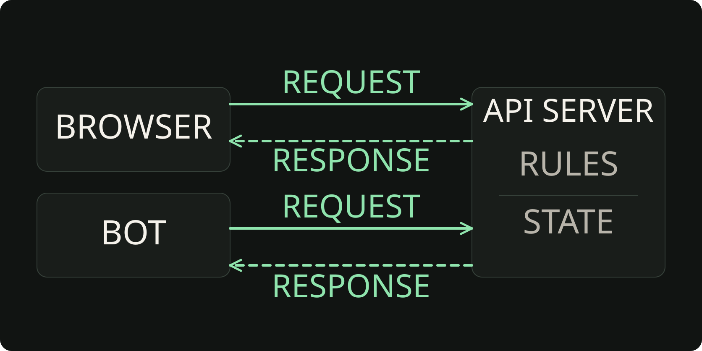

# 45. Почему CLI недостаточно: клиент и сервер

В прошлом проекте Planner уже умел работать с задачами. Мы вводили команды в терминале, а программа применяла правила и сохраняла результат. Теперь представим, что тот же список хочется открыть в браузере или посмотреть через бота. Как дать этим программам доступ к приложению, не заставляя каждую становиться ещё одним Planner?

## 00. Когда нужен ещё один способ пользоваться приложением

Удобный терминал уже решил нашу первую задачу. Но человек может захотеть работать со списком с телефона, нажимать кнопки в браузере или отправлять команды боту. Меняется способ общения с приложением, а смысл задачи остаётся прежним.

Можно написать три отдельные программы. Тогда придётся решать, где у каждой лежат данные и кто проверяет правила. Если браузер разрешает одно, а бот другое, пользователь получает не два интерфейса, а два разных продукта. Нам нужна общая часть, к которой смогут обращаться разные программы.

Это похоже на службу бронирования переговорных. Один сотрудник выбирает время на сайте, другой пишет администратору. Способ обращения разный, но расписание должно быть одно. Нельзя независимо обещать одну комнату двум людям на одно время.

1. **Что уже есть.** В Persistent Planner интерфейс CLI вызывает сервис, а сервис работает с хранилищем.
2. **Что меняется.** Теперь к приложению хочет обратиться другая программа, а не только его собственный CLI.
3. **Что выясним.** Кто принимает просьбу, кто решает, можно ли её выполнить, и откуда берётся результат на экране.

Работающий сетевой сервер пока не нужен. Сначала разберём модель общения. В примерах будем исследовать знакомый Python-код, а в практике объясним несколько ситуаций своими словами.

## 01. Локальный вызов работает внутри своей программы

CLI означает Command Line Interface, интерфейс командной строки. Он принимает текстовые команды и показывает результат в терминале. В нашем Persistent Planner команда передавалась локальному `PlannerService`, а `JsonStorage` читал или записывал `tasks.json`.

У такого пути есть свои преимущества. Программу удобно запускать на своём компьютере, команды можно повторять, а работу легко включить в скрипт. Но внешний пользователь должен получить проект и разобраться с его запуском. Само наличие CLI ещё не даёт отдельному браузеру способ обратиться к приложению.

Внутри Python-программы функция доступна потому, что она определена или импортирована в эту программу. Посмотрим на маленький пример расписания. Что происходит между вызовом функции и появлением строки в терминале?

```python
def format_slots(slots):
    return ", ".join(slots)

slots = ["10:00", "11:00"]
label = format_slots(slots)
print(label)
```

**Проходим выполнение по шагам.** На платформе можно переключать строки и смотреть значения.

1. Python определяет функцию. Её тело пока не выполняется: вызова ещё не было.
2. В памяти программы появляется список `["10:00", "11:00"]`.
3. Программа вызывает свою функцию и передаёт ей список. Здесь нет обращения к другой программе.
4. `join` соединяет строки через запятую и пробел. Функция возвращает `"10:00, 11:00"` вызывающему коду.
5. После возврата строка записывается в `label`.
6. `print` показывает в терминале `10:00, 11:00`. Это локальный вывод, а не ответ браузеру.

Это подготовленный разбор выполнения, не запущенный в странице интерпретатор. Сам пример можно выполнить обычным Python. Важно другое: вызов и функция принадлежат одной программе. Нельзя написать имя этой функции в отдельном браузере и таким образом вызвать её в памяти Python.

CLI тоже может быть клиентом сетевого приложения. Ограничение относится не ко всем терминальным программам, а к нашему нынешнему пути: он напрямую использует локальные модули. Для отдельного клиента нужен другой способ общения.

## 02. Клиент помогает человеку обратиться к приложению

Клиентом называют программу, которая начинает обращение к другой программе. В этой роли могут выступать браузер, мобильное приложение, бот или скрипт. Человек выбирает действие, а клиент передаёт его намерение и затем показывает полученный результат.

Например, на сайте бронирования клиент показывает расписание, собирает выбранное время и помогает заполнить форму. Он может подсветить незаполненное поле сразу, не ожидая ответа. Это полезно: человек быстрее замечает ошибку.

Но удобство формы не делает её окончательным судьёй. Другой клиент может не иметь такой проверки. Пользователь может изменить отправленные данные. Расписание может измениться, пока форма открыта. Поэтому проверка на клиенте помогает человеку, но не заменяет проверку в приложении, которое отвечает за бронь.

На сайте нельзя выбрать уже занятое время. Почему это не исключает неверную бронь через бота?

- A. Да, кнопка на сайте защищает все способы обращения.
- B. Нет, правило нужно проверить и при обработке обращения бота.
- C. Да, если сайт и бот работают на одном компьютере.

<details>
<summary>Проверить рассуждение</summary>

Верно B. Ограничение кнопки действует только в этом интерфейсе. Бот обращается другим способом, а время могло измениться. Общая проверка должна действовать независимо от клиента.

</details>

После обращения работа клиента продолжается. Он показывает подтверждение, обновляет список или объясняет отказ. Но сообщение «готово» на экране должно опираться на результат обработки, а не только на факт нажатия кнопки.

## 03. Сервер принимает решение по общим правилам

Сервер здесь означает работающую программу, которая принимает обращения клиентов, выполняет нужную работу и возвращает результат. Словом «сервер» также называют компьютер, но сейчас нам важна роль программы, а не характеристики устройства.

Серверная часть знает общие правила и текущее состояние приложения. Состояние означает данные о том, что происходит сейчас: какое время свободно, какие брони уже существуют. Обработчик обращения проверяет просьбу по этим данным, а не доверяет старой картинке на экране клиента.

Покажем только предметное правило на Python. Функция ниже ещё не является сетевым сервером: она ничего не принимает по сети. Такой код помогает увидеть решение, которое в будущем будет выполняться на серверной стороне.

**Рабочая модель: занять свободное время**

```python
def reserve_slot(slots, time):
    if time not in slots:
        return "Такого времени нет"
    if slots[time] == "занято":
        return "Время уже занято"
    slots[time] = "занято"
    return "Бронь подтверждена"

slots = {"10:00": "свободно", "11:00": "занято"}
print(reserve_slot(slots, "10:00"))
print(slots["10:00"])
```

На входе словарь с текущим расписанием и выбранное время. Ключ выбирает запись, значение описывает её состояние. Сначала функция проверяет, существует ли время и свободно ли оно. Только после этого запись меняется. Пример напечатает «Бронь подтверждена», затем «занято».

**Исследуем три входа.**

Теперь переключаем три входа. Ниже показан фрагмент той же функции и подготовленные результаты. Каждый сценарий начинается с исходного расписания из примера, а не продолжает предыдущую бронь.

- Выбрано `"10:00"`: «Бронь подтверждена». Это время теперь занято.
- Выбрано `"11:00"`: «Время уже занято». Расписание не изменилось.
- Выбрано `"12:00"`: «Такого времени нет». Расписание не изменилось.

Отказ тоже является результатом работы. Вторая бронь не должна появиться только потому, что клиент попросил её создать. Сервер защищает правило приложения и сообщает, почему просьба не выполнена.

Здесь обращения рассматриваются по очереди. В реальном сервисе одновременное бронирование требует дополнительной защиты от конкурирующих изменений. Этот пример показывает порядок проверки и изменения, а не готовую систему бронирования для production.

## 04. Request и response связывают две программы

Когда клиент обращается к серверу, между ними проходит сообщение. Request означает запрос: клиент сообщает, чего хочет и какие данные передаёт. Response означает ответ: сервер сообщает результат обработки.

API расшифровывается как Application Programming Interface, программный интерфейс приложения. Вообще интерфейс может связывать и части одной программы. В этом курсе речь идёт о внешнем сетевом API: согласованном способе обратиться к приложению, не зная его внутренних Python-функций.

HTTP, Hypertext Transfer Protocol, задаёт правила обмена запросами и ответами. Это не библиотека и не название сервера. Как именно устроены сообщения, изучим дальше. Сейчас проследим один разговор: человек выбирает время, клиент передаёт просьбу, сервер принимает решение, клиент показывает полученный ответ.

Каков порядок событий от выбора времени до результата? На каком шаге появляется основание показать человеку итог?

- Сервер отправил response с результатом.
- Клиент отправил request серверу.
- Клиент показал подтверждение или отказ.
- Человек выбрал время, клиент подготовил просьбу.
- Сервер проверил расписание и выполнил допустимое действие.

<details>
<summary>Сверить порядок</summary>

Человек выбрал время → клиент отправил request → сервер проверил расписание и выполнил допустимое действие → сервер отправил response → клиент показал результат.

Нажатие кнопки ещё не подтверждает бронь. Клиент получает основание показать итог после ответа об обработке. Проверка и допустимое изменение происходят на серверной стороне.

</details>

Если время занято, разговор не обрывается на проверке: сервер возвращает отказ, а клиент объясняет его человеку. Если ответ не получен из-за проблем со связью, клиент не знает итог только по этому факту. Нельзя автоматически объявить ни успех, ни отсутствие изменения. Подробности сетевых сбоев пока оставим за рамками занятия.

Проверим порядок на знакомом фрагменте функции. Ожидание: попытка занять уже занятое время должна вернуть отказ. Вход содержит запись «занято», но код ниже возвращает подтверждение. Находим причину.

```python
def reserve_slot(slots, time):
    if time not in slots:
        return "Такого времени нет"
    slots[time] = "свободно"
    if slots[time] == "занято":
        return "Время уже занято"
    slots[time] = "занято"
    return "Бронь подтверждена"
```

**Отладка.** Почему при уже занятом времени функция ошибочно подтверждает бронь?

- A. В Python нельзя сравнивать строки в словаре.
- B. Функция стирает прежнее состояние перед проверкой и сама делает время свободным.
- C. Любая функция обязана возвращать только True или False.

<details>
<summary>Причина и локальное исправление</summary>

Верно B. Строка `slots[time] = "свободно"` уничтожает факт существующей брони. Следующая проверка уже не может его обнаружить. Ошибка в порядке работы с данными, а не в сравнении строк.

```python
# Убираем сброс состояния перед проверкой.
if slots[time] == "занято":
    return "Время уже занято"
slots[time] = "занято"
```

</details>

Исправление показано как фрагмент: оно остаётся внутри функции после проверки существования времени. Сначала узнаём, допустимо ли действие, затем меняем данные. Переименование клиента в браузер или бот этот порядок не меняет.

## 05. Два участника не обязательно означают два компьютера

Клиент и сервер описывают роли в общении. Во время разработки браузер и Python-сервер могут работать на одном ноутбуке. Между ними всё равно остаётся граница отдельных программ.

Процессом называют запущенный экземпляр программы. У Python-сервера своя память. У браузера свои процессы и память. Соседство на одном устройстве не превращает серверную функцию в функцию браузера: для общения нужен предусмотренный способ обмена.

Имя `localhost` указывает на компьютер, с которого выполняется обращение. Если открыть адрес с localhost на телефоне, он относится к самому телефону, а не автоматически к ноутбуку разработчика. Это полезное имя для локальной проверки, но не адрес публикации приложения в интернете.

Порт помогает направить сетевое обращение нужной программе. Представим адрес здания и номер кабинета: одного адреса мало, если внутри несколько получателей. У сетевого сервиса роль такого номера выполняет порт. Пока достаточно этой ориентации, команды запуска и настройка будут в следующем блоке.

**Верно или неверно?** Если браузер и Python-сервер работают на одном ноутбуке, браузер может просто вызвать серверную функцию по её имени.

<details>
<summary>Объяснение</summary>

Неверно. Функция находится в памяти другой программы. Один компьютер не отменяет границу процессов. Клиент обращается через внешний интерфейс, а сервер сам вызывает нужную функцию.

</details>

## 06. Два клиента обращаются к одному приложению

Браузер может показывать расписание клетками, а бот присылать текст. Один интерфейс удобно нажимать, другой удобно использовать в переписке. Эти различия полезны и не требуют двух независимых расписаний.

Оба клиента обращаются к одному серверу по одному договору. Под договором понимаем согласованные правила общения: какие просьбы приложение принимает и как сообщает результат. Клиенту не требуется знать, какая функция проверила бронь и как устроено хранение внутри.

На схеме у каждого клиента своя пара сообщений. Прослеживаем верхнюю пару для браузера, затем нижнюю для бота. Ответ в каждом разговоре возвращается отправителю запроса. Правила и состояние находятся на общей серверной стороне.



Общие правила и состояние, разные интерфейсы. Ответ браузеру не становится автоматически ответом боту.

У клиента и сервера разные обязанности. Какому участнику соответствует каждый пример?

Кто отвечает за каждую из этих задач?

- Показать расписание клетками или текстом.
- Не дать повторно занять уже занятое время.

Варианты: «Клиент: удобный интерфейс»; «Сервер: общее правило».

<details>
<summary>Проверить пары</summary>

Первый пример относится к клиенту, второй к серверу. Вид расписания можно менять в отдельном клиенте. Проверка допустимости брони остаётся общей и не зависит от расположения кнопок.

</details>

Так устроены, например, сервисы с сайтом и мобильным приложением: интерфейсы отличаются, а предметные действия согласованы. В нашем Planner сохранится один набор правил и данных. Позже к CLI добавится HTTP-вход, который будет обращаться к той же логике.

## 07. Копия на экране может устареть

Общий источник данных не означает, что все экраны всегда показывают одно и то же. Клиент получает сведения в определённый момент. Если позже другой клиент что-то изменил, прежнее отображение может остаться без обновления.

Представим: браузер получил свободное время и оставил расписание открытым. Бот затем занял это время, сервер подтвердил бронь именно боту. Ответ боту сам по себе не сообщает браузеру, что его данные устарели.

Проверим эту мысль знакомым словарём. Это модель отдельных копий в одной Python-программе, не сетевой обмен. В настоящем приложении клиент получает данные в сообщении, а не читает серверную переменную.

**Что напечатает этот код?**

```python
server_slots = {"10:00": "свободно"}
browser_slots = server_slots.copy()
server_slots["10:00"] = "занято"
print(browser_slots["10:00"])
print(server_slots["10:00"])
```

Подсказка: `copy` создаёт другой словарь. Значения здесь строки, общих вложенных изменяемых объектов нет.

<details>
<summary>Показать вывод</summary>

```text
свободно
занято
```

</details>

Изменился `server_slots`, а `browser_slots` остался прежним. Первая строка вывода описывает сохранённую копию, вторая текущее состояние модели сервера. Два значения не доказывают, что бронь не состоялась: они получены в разное время.

Источником истины называют место, по которому определяют актуальное состояние приложения. В нашей модели это серверная сторона. Экран хранит удобное для показа представление, но не становится главным расписанием.

Для обновления браузер может снова запросить данные. Когда и как это происходит, зависит от устройства клиента. Некоторые приложения получают уведомления об изменениях, но здесь мы их не реализуем. Важно не обещать автоматическую синхронизацию только потому, что сервер общий.

Браузер всё ещё показывает свободное время, хотя бот получил подтверждение брони. Почему эти факты не противоречат друг другу?

<details>
<summary>Сверить объяснение</summary>

Браузер показывает сведения, полученные раньше. Сервер изменил состояние и ответил боту. Пока браузер не получил свежие данные, его экран может отставать от текущего расписания.

</details>

## 08. Доступ к данным не равен доступу к файлу

В локальном Planner `JsonStorage` работал с `tasks.json`. Легко представить следующий шаг так: «пусть браузер тоже откроет этот файл». Но файл хранения и внешний интерфейс приложения решают разные задачи.

Хранилище обслуживает внутреннюю работу программы. API принимает просьбу, даёт применить правила и возвращает нужный результат. Если клиент напрямую меняет файл, он может обойти правила и начинает зависеть от пути, формата и устройства хранения.

Это как общий журнал бронирования. Посетителю можно дать понятный способ попросить комнату. Если вместо этого каждый сам исправляет страницы журнала, никто не контролирует, допустима ли запись. Право попросить действие не означает право менять внутренние записи как угодно.

Сервис заменил внутренний файл хранилищем другого вида, но сохранил внешний договор. Какому клиенту не нужно знать о такой замене?

- Клиент, который открывает конкретный путь и разбирает содержимое файла.
- Клиент, который просит сведения через API и получает согласованный ответ.

<details>
<summary>Объяснение выбора</summary>

Если договор сохранён, клиент API продолжает общаться прежним способом. Прямой читатель файла зависит от его существования и структуры. Речь не о запрете любых файловых интерфейсов, а о границе нашего сетевого приложения.

</details>

JSON задаёт формат данных, но не требует хранить их именно в файле. В нашем Planner существующий `tasks.json` останется внутренним хранилищем: `JsonStorage` будет читать и сохранять его, а API обратится к хранилищу через `PlannerService`. Клиент получит согласованный ответ, но не доступ к пути или внутреннему формату файла.

## 09. Тот же Planner, новая точка входа

Persistent Planner не выбрасываем и не переписываем. CLI, `PlannerService` и `JsonStorage` остаются частями проекта. Меняется способ обратиться к уже знакомым операциям.

В этом блоке разбираем договор между клиентом и сервером, поэтому пока не меняем код. После HTTP-подготовки добавим FastAPI-интерфейс к существующему `PlannerService`. Браузер и бот будут обращаться к серверу, а сервер передаст действие знакомой логике Planner.

- **Один проект.** CLI остаётся на месте. FastAPI станет ещё одним входом в тот же Persistent Planner.
- **Общие правила.** HTTP-обработчик передаст операцию существующему `PlannerService`, а не создаст собственные правила.
- **Общие данные.** `JsonStorage` продолжит читать и сохранять тот же `tasks.json`. Клиент не открывает файл напрямую.

~~~text
Сейчас: CLI → PlannerService → JsonStorage → tasks.json
Позже: HTTP-клиент → FastAPI → тот же PlannerService
                                      ↓
                                  JsonStorage → тот же tasks.json
~~~

Источник актуального состояния и долговечность данных связаны, но это разные свойства. `PlannerService` получает текущее состояние через `JsonStorage`, а файл сохраняется между запусками. Браузер же может временно показывать старую копию, пока не запросит свежий ответ API.

В блоке 9 разбираем HTTP-договор и не меняем Persistent Planner. После его завершения в следующем блоке добавим FastAPI к существующему сервису и хранилищу. Следующее занятие уточнит, какие части входят в сообщение клиента.

## 10. Что мы будем делать в практике

Перенесём модель на знакомые задачи Planner. Практика остаётся устной: достаточно разобрать ситуации и обосновать вывод. Документ, сервер и знание номеров HTTP-статусов не требуются.

1. **Сравнить пути.** Проследить чтение списка через прежний CLI и через будущего отдельного клиента.
2. **Разобрать действие.** Рассмотреть создание задачи при двух разных вводах и объяснить последствия.
3. **Связать клиентов.** Сравнить браузер и бот, затем разобрать экран, который ещё не получил новое состояние.
4. **Проверить границу.** Оценить предложения о доступе к хранению и о зависимости сервера от кнопок.

В каждом сценарии важна причинная цепочка: кто начал действие, кто получил данные, на каком основании принято решение и что увидит человек. Последний сценарий показывает последствия неверного разделения обязанностей.

К завершению занятия мы объясняем путь обращения и отличаем актуальные данные от копии на экране. Структуру HTTP-запроса, адреса операций и серверный код пока не разбираем.

<!-- youtube: -->
