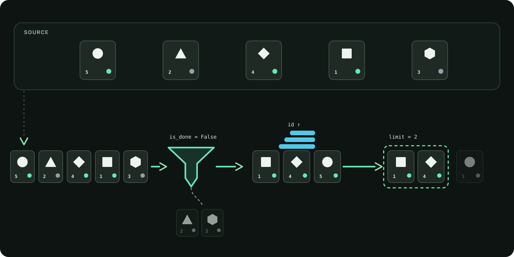

# 55. Query-параметры: фильтрация, сортировка и границы

<!-- youtube: -->

## От одной задачи к удобному списку

В прошлом занятии `GET /tasks/{task_id}` научился возвращать одну задачу по её `id`. Сам `GET /tasks` уже показывает список реальных задач Planner. Теперь добавим клиенту возможность настроить вид этого списка.

Отдельный адрес для каждой комбинации быстро превратился бы в набор почти одинаковых маршрутов. Вместо этого оставим `/tasks` и передадим настройки после вопросительного знака. Такие настройки называются query-параметрами.

```text
GET /tasks
GET /tasks/7
GET /tasks?is_done=false&sort_desc=true&limit=10
```

Первый адрес просит коллекцию задач. Второй выбирает одну задачу с `id = 7`. Третий просит тот же список, но только открытые задачи, в обратном порядке и не больше десяти за раз. Path выбирает ресурс, а query настраивает чтение коллекции.

После `?` идут пары «имя=значение». Несколько параметров разделяются символом `&`. Порядок пар в адресе не задаёт порядок обработки: `limit=10&is_done=false` передаёт те же условия.

## Необязательный фильтр: `None`, `True` и `False`

`is_done` описывает состояние задачи. Здесь есть три разных случая:

| Значение в обработчике | Смысл |
| --- | --- |
| `None` | Условие не передано. Показать задачи обоих статусов |
| `True` | Показать завершённые задачи |
| `False` | Показать открытые задачи |

Например, `GET /tasks?is_done=false` содержит переданный фильтр. FastAPI преобразует текст `false` из URL в Python-значение `False`. Если параметра нет, его значение по умолчанию `None`.

Поэтому проверка `if is_done:` здесь неверна. Python считает `False` ложным, и код спутает явный запрос открытых задач с отсутствием фильтра. Проверяйте именно отсутствие значения:

```python
if is_done is not None:
    # оставить задачи, у которых task.is_done совпадает с is_done
    ...
```

Если правильно заданный фильтр не нашёл совпадений, список пуст. Это успешное чтение коллекции, а не ошибка отсутствующего ресурса. Для такого ответа подходит `200` и `[]`. Код `404` нужен для запроса конкретной задачи, которой нет по указанному id.

## FastAPI преобразует и проверяет параметры

Значения URL приходят как текст. Аннотации типов сообщают FastAPI, какое значение нужно получить обработчику: например, `bool` или `int`. Если клиент отправил `?limit=12`, обработчик получает число `12`. Если вместо него передано `many`, FastAPI не запускает маршрут с некорректным значением.

`Query` позволяет описать правила для параметра. В этом независимом примере на каталоге книг значение по умолчанию равно 10, а допустимый диапазон начинается с 1 и заканчивается на 50:

```python
from fastapi import Query

@app.get("/books")
def list_books(
    newest: bool = False,
    limit: int = Query(default=10, ge=1, le=50),
):
    ...
```

`ge=1` означает «больше или равно 1», а `le=50` означает «меньше или равно 50». Обе границы входят в диапазон. `limit=1` и `limit=50` допустимы; `0`, `51` и нецелое значение `many` не подходят.

Для Planner договор такой: если клиент не передал `limit`, ответ ограничен десятью задачами. Явный `limit` может быть от 1 до 50. При неверном типе или значении FastAPI возвращает `422` до вызова обработчика. Сервис не должен подменять неправильный ввод ближайшей границей.

Это важно для границы ответственности: HTTP проверяет вход. Сервис получает уже разобранные типы. Пустой результат поиска остаётся `200`, а неверное значение query останавливается с `422`.

## Фильтр → сортировка → limit

Когда параметры проверены, Planner готовит список для ответа. Порядок действий имеет значение:

1. Фильтр убирает из текущего результата записи, которые не подходят.
2. Сортировка располагает оставшиеся задачи по уникальному `id`.
3. `limit` берёт начало уже подготовленного списка.

Например, сначала выберем открытые задачи, затем отсортируем их по `id`, а после возьмём первые две. Если применить limit раньше фильтра, нужные задачи могут оказаться за срезом и не попасть в ответ.



`sorted(tasks, key=..., reverse=...)` возвращает новый список и не меняет исходный порядок. Для Planner сортируем по `task.id`, а направление задаёт `sort_desc`: `False` означает возрастание, `True` означает убывание. После сортировки срез `tasks[:limit]` тоже создаёт новый список.

Задачи копировать не требуется, пока мы только читаем их поля и не меняем сами объекты. Главное не использовать `tasks.sort()` на списке источника и не вызывать сохранение. GET подготавливает ответ, но оставляет JSON и состояние Planner без изменений.

## Выборка остаётся частью PlannerService

Новая операция сервиса, например `select_tasks`, должна начинать с существующего `list_tasks()`. Так API продолжает читать тот же источник, который уже используют CLI и остальные маршруты. Прямое чтение JSON из endpoint создало бы второй путь, который со временем мог бы разойтись с логикой проекта.

У сервиса и HTTP разные настройки по умолчанию. Для сервиса отсутствие `limit` может означать «не ограничивать список». HTTP при этом задаёт собственный default `10`. Так старый CLI продолжает получать полный список, а веб-клиент получает разумный ограниченный ответ.

HTTP-маршрут только связывает проверенные параметры с сервисом и формирует уже принятую публичную проекцию:

```text
query из URL
→ FastAPI преобразует и проверяет значения
→ PlannerService готовит выборку из list_tasks
→ GET возвращает id, title, priority и is_done
```

Не добавляйте все внутренние поля автоматически. Например, `tags` остаётся частью Task и JSON-файла, но публичный ответ списка по-прежнему содержит только согласованные поля.

Фильтр не переписывает хранилище. Поэтому `GET /stats` продолжает считать все задачи, а не только текущую выборку. Полный список CLI также не получает HTTP-ограничение в десять элементов.

## Что мы будем делать в практике

Мы расширим существующий Planner API, а не будем собирать параллельную учебную версию.

Сначала добавим `select_tasks` в `PlannerService`. Он использует готовый `list_tasks`, учитывает необязательный статус, сортирует по `id` и применяет переданный limit последним. Затем подключим проверенные query-параметры к тому же `GET /tasks`.

В Planner collection проверим оба статуса, направления сортировки, границы `limit=1` и `limit=50`, а также ошибочные значения. Для проверки порядка подготовим несколько открытых задач. В конце сравним результат с полным CLI-списком, чтением одной задачи и `GET /stats`, чтобы убедиться: меняется только ответ запроса, а не данные проекта.

Не добавляем новый маршрут, отдельное хранилище, произвольную сортировку или постраничную навигацию. Настоящий POST с JSON body будет следующим шагом.
